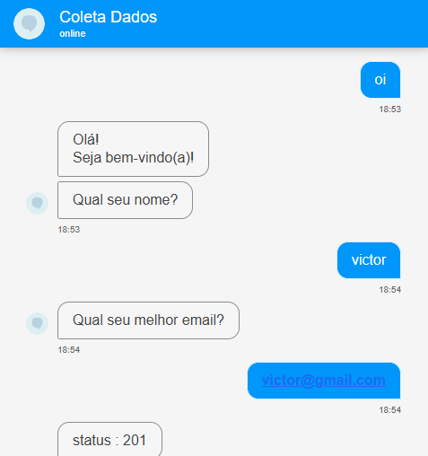
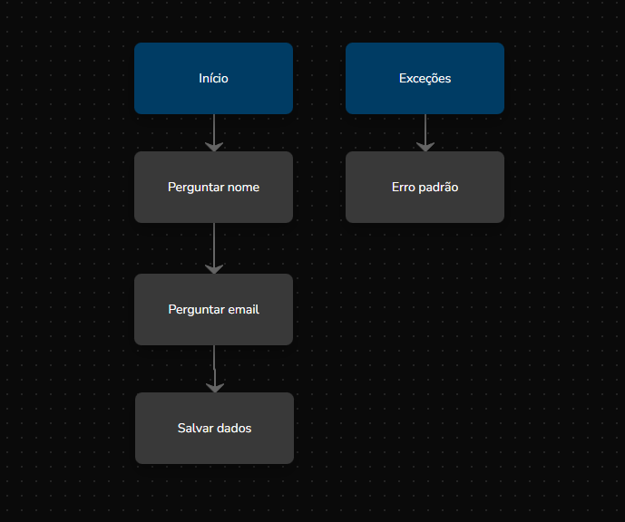
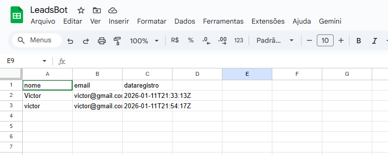

# Chatbot de Captura de Leads Integrado (Blip + Google Sheets)

## 📋 Sobre o Projeto
Este projeto consiste em um assistente virtual desenvolvido na plataforma **Blip** capaz de qualificar leads e armazenar os dados automaticamente em uma planilha do Google Sheets via API REST.

## 🚀 Funcionalidades
- **Fluxo Conversacional:** Interação natural para coleta de dados (Nome e E-mail).
- **Consumo de API (GET):** Consulta externa (ex: Cotação de Moedas/API de Teste).
- **Integração de Banco de Dados (POST):** Envio de dados para o Google Sheets utilizando SheetDB como middleware.
- **Tratamento de Dados:** Scripts em JavaScript (ES6) para manipulação de JSON e variáveis de contexto.

## 🛠 Tecnologias Utilizadas
- **Blip Builder:** Construção do fluxo conversacional.
- **JavaScript:** Scripts de tratamento de dados e lógica de negócio.
- **HTTP/REST:** Integração via métodos GET e POST.
- **SheetDB:** Transformação da planilha Google em API REST.
- **JSON:** Formatação e tráfego de dados.

## 📸 Demonstração
### Fluxo de Conversa

### Arquitetura do Fluxo

### Dados Salvos (Google Sheets)

## 👨‍💻 Como executar
Para replicar este projeto, você pode importar o arquivo `.json` localizado na pasta `/fluxo` para sua conta do Blip e configurar as variáveis de API.

